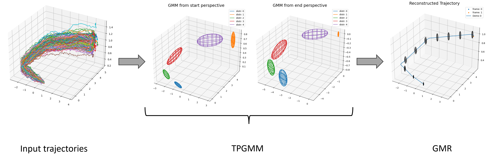

# TaskParameterizedGaussianMixtureModels

## Overview

This repository contains the implementation of two classes: `TPGMM` (Task Parameterized Gaussian Mixture Model) and `GaussianMixtureRegression`. The classes are based on the following signatures:



### TPGMM (ClassificationModule)

This class is an implementation of the task parameterized Gaussian mixture model according to the paper by Calinon [link](https://calinon.ch/papers/Calinon-JIST2015.pdf). It includes an Expectation Maximization Algorithm with E-Step and M-Step as well as an optimization criterion for log-likelihood. The class is designed to fit trajectories and analyze their components.

### GaussianMixtureRegression (RegressionModel)

This class implements a Gaussian mixture regression model. It fits a Gaussian mixture regression based on a given Gaussian Mixture model or a Task-Parameterized Gaussian Mixture model. The equations used in the implementation are detailed in the paper by S. Calinon [link](https://calinon.ch/papers/Calinon-JIST2015.pdf).

## TPGMM Class

### Methods

- `fit(trajectories)`: Fits the TPGMM model to the input trajectories.
- `predict(new_data)`: Predicts the components for new data based on the trained model.

### Attributes

- `weights_`: Array of weights between Gaussian components.
- `means_`: Matrix of means for each frame and component.
- `covariances_`: Matrix of covariance for each frame and component.

### Parameters

- `n_components` (int): Number of components.
- `tol` (float): Threshold to break from EM algorithm. Defaults to 1e-3.
- `max_iter` (int): Maximum number of iterations for the expectation maximization algorithm. Defaults to 100.
- `min_iter` (int): Minimum number of iterations for the expectation maximization algorithm. Defaults to 5.
- `weights_init` (ndarray): Initial weights between each component. Defaults to None.
- `means_init` (ndarray): Initial means between each component. Defaults to None.
- `reg_factor` (float): Regularization factor for the empirical covariance matrix. Defaults to 1e-5.
- `verbose` (bool): Triggers the print of learning stats. Defaults to False.

For more detailed usage instructions, please refer to the docstrings within the code.

## GaussianMixtureRegression Class

### Methods

- `fit(trajectory)`: Fits the Gaussian Mixture Regression on the provided trajectory data.

### Parameters

- `weights` (ndarray): Array of weights from the TPGMM model.
- `means` (ndarray): Matrix of means from the TPGMM model.
- `covariances` (ndarray): Matrix of covariances from the TPGMM model.
- `input_idx` (list): Index of the input.

For more detailed usage instructions, please refer to the docstrings within the code.

## Example Usage

How to use this model is documented in a example Jupyter-Notebook at [`examples/example.ipynb`](examples/example.ipynb). 

## Run tests

Tests can be found in: `tests/` and executed with:

```bash
python -m unittest discover tests
```

## Contribution

We welcome contributions to improve the project and encourage community feedback. To contribute, follow these steps:

1. Fork the repository.
2. Create a new branch.
3. Make your changes and commit them.
4. Push your changes to the branch.
5. Submit a pull request.

Before making a significant change, please open an issue to discuss what you would like to change. Ensure that any new or updated code is appropriately tested.

## Support

For any questions, concerns, or suggestions, submit an issue. We appreciate your feedback and are committed to providing support and addressing any issues you may encounter. If you have found a bug or need assistance, please submit an issue to the issue tracker. We will make every effort to respond to your queries and resolve any problems you may have.
